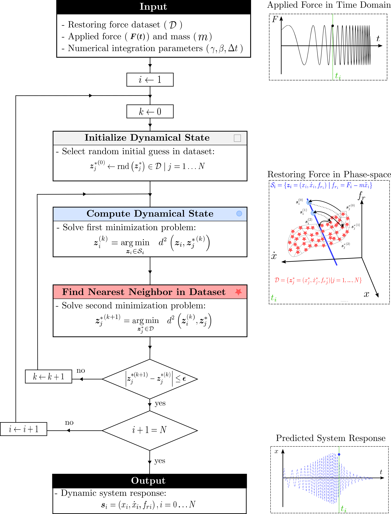
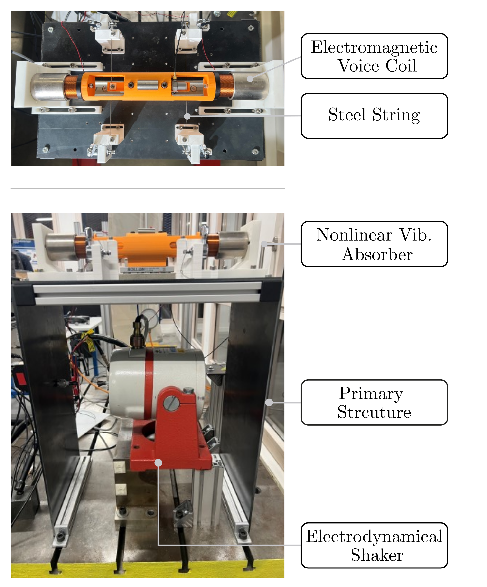

# DDCNStr - Data-Driven Model-Free Computing for Nonlinear Structural Dynamics

This repository contains the experimental data and Matlab/Python codes implemented for the paper "Data-driven model-free approach for nonlinear
structural dynamics". 
\
\
Jessé Paixao 1 , Auriane Platzer 1 , Jonathan Rodriguez 1 , Louis Mesny 2 , Nawfal Blal 1 , Sébastien Baguet 1  
 
<em> 1  INSA Lyon, CNRS, LaMCoS, UMR5259, 69621, Villeurbanne, France </em>  
<em> 2  CA, University of Toulouse, CNRS, ISAE-Supaero, MINES ALBI, UT3, INSA, Toulouse 31055, France <\em>

## Data-driven model-free Solver & Experimental Setup

    &ensp;   &ensp;        

## License
This repository is released under the MIT license. See [LICENSE](LICENSE) for additional details.

## Contact
Please feel free to contact us if you have any questions about the code.  
Email: jesseag.paixao@fgmail.com
